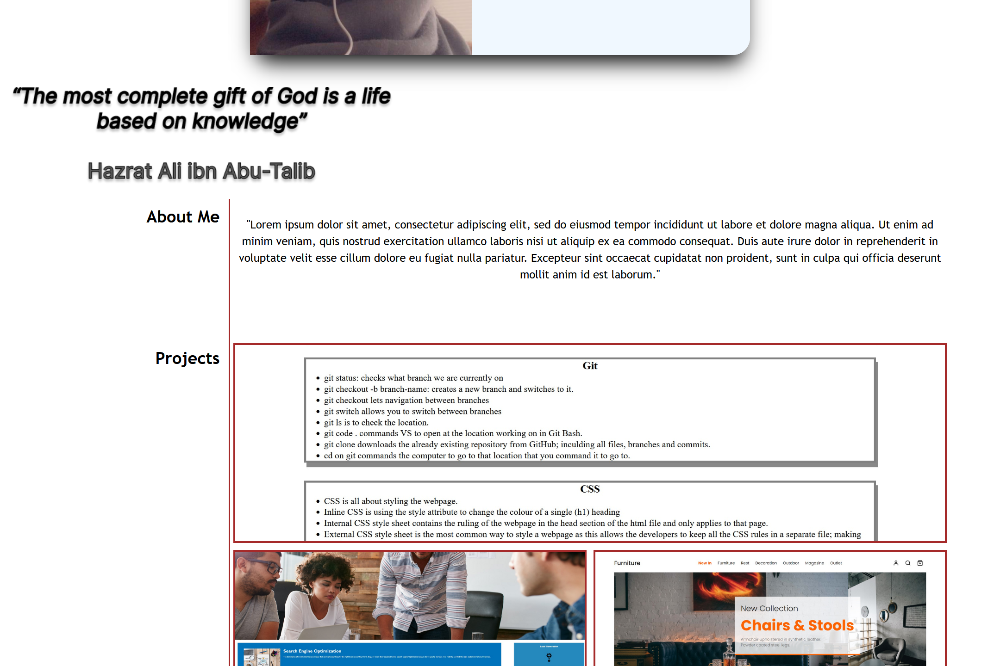

# My Portfolio

## User Story

AS A customer:

- I WANT an online portfolio that will display all my future projects

- SO THAT it is accessble for a protential customer to see my skills as a newly developed front-end web developer all in one place.

To acheive the User Story, I was set this challenge to effectively structure a webpage using HTML and CSS with various attributes and to make it user and media friendly

## Installation

N/A

## Usage

The screenshot shows how the website now looks and its accessibility

## Credits

Followed the following tutorials;

- [Object Position CSS](https://www.w3schools.com/css/css3_object-position.asp)
- [Flexbox CSS](https://www.w3schools.com/css/css3_flexbox.asp)
- [Grid Container CSS](https://www.w3schools.com/css/css_grid_container.asp)
- [Media Queries CSS](https://www.w3schools.com/css/css_rwd_mediaqueries.asp)
- [Float CSS](https://developer.mozilla.org/en-US/docs/Learn/CSS/CSS_layout/Floats)
- README.md files provided by Bootcamp were used and can be found in the assets folder.

## License

MIT License; Copyright (c) 2022 Mehr-Un-Nasa Hejazi
Please refer to the LICENSE in the repository for further information.
